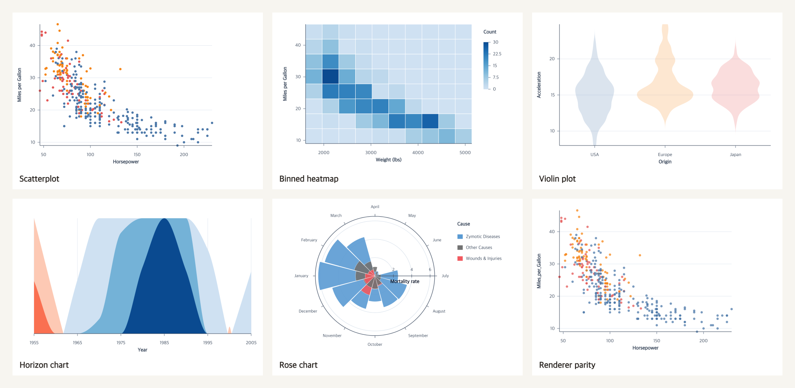

# Gate R53-P0-B — Baseline Result and Knowledge Boundary

## Gate state

`approved`

Approved by the user on 2026-08-06. Gate package checkpoint: `83a3588b` (`docs: prepare roadmap 5.3 gate b`).

Evidence checkpoints:

- Current-doc result: `55c412ff` (`test: summarize current docs baseline`)
- Final schemas and boundary: `268c36aa` (`docs: freeze llm knowledge contract`)
- Remote branch: `origin/codex/roadmap5-3-llm-friendly`

## 쉽게 보는 결론

현재 docs만 준 LLM은 48번 중 17번만 최종 성공했다. 가장 큰 문제는 잘못된 차트를 만드는 것보다, 문서를 찾느라
허용된 세 번의 model call을 전부 쓰고도 실행 코드를 제출하지 못한 경우였다. 따라서 Phase 1~5는 문서를 더 길게
만드는 작업이 아니라 **작은 overview → 정확한 action 설명 → 실제 task recipe → 같은 지식의 search/MCP 제공**으로
탐색 경로를 짧게 만드는 작업이다.

## Current-doc baseline

| 항목 | 결과 |
| --- | ---: |
| Model/settings | `gpt-5.6-terra`, medium reasoning, low verbosity |
| Runs | 24 tasks × 2 = 48 |
| First-pass correctness | 17/48 (35.42%) |
| Final correctness | 17/48 (35.42%) |
| Authoring / held-out | 12/24 (50%) / 5/24 (20.83%) |
| Successful token median / p95 | 12,682 / 16,811 |
| Successful model-call median / p95 | 3 / 3 |
| Successful time-to-valid median / p95 | 9,536 ms / 15,419 ms |
| Total calls / tokens | 144 / 643,846 |
| Actual estimated cost | $1.6942 |

실패 31건은 `invalid-program` 27, `missing-action` 2, `runtime-error` 2다. 실패와 timeout을 denominator에서 빼지
않았다. Renderer-parity 두 반복은 Canvas/SVG/PNG/PDF를 모두 통과했다. Aggregate와 sanitized 48-run record는
[`CURRENT_DOCS_BASELINE.json`](./CURRENT_DOCS_BASELINE.json), 사람이 읽는 해석과 대표 렌더는
[`CURRENT_DOCS_BASELINE.md`](./CURRENT_DOCS_BASELINE.md)가 소유한다.

## 승인 대상 knowledge contract

1. Exact behavior는 `agent_docs/contract/current/`와 `ACTION_INDEX.json`에 남긴다.
2. Exact public signature는 types/signature generator에서 결합하고 narrative source에 복사하지 않는다.
3. `knowledge/actions/*.json`은 English summary/use/avoid/state/parameter notes/effects/errors/example/relation을 소유한다.
4. `knowledge/recipes/*.json`은 task intent, ordered steps, action roles, alternatives, pitfalls와 executable example을
   소유한다.
5. `knowledge/recipe-coverage.json`은 173 action을 정확히 한 번씩 분류하고 `unclassified = 0`을 강제한다.
6. Generated `knowledge/index.json` 하나를 docs, deterministic search와 local MCP가 공동 사용한다.

Exact source schemas와 validation/package matrix는 [`KNOWLEDGE_CONTRACT.md`](./KNOWLEDGE_CONTRACT.md)가 소유한다.

## Phase 1~5 boundary

- Phase 1: 작은 English overview/action/recipe/detail route와 drift/size guard.
- Phase 2: 173-action informative metadata, signature join과 executable example validation.
- Phase 3: High-coverage task recipes, all-action classification과 primary coverage 100%.
- Phase 4: Stable tie-break와 bounded output을 갖는 deterministic local search.
- Phase 5: 기존 package에 local read-only `ggaction-mcp` stdio bin을 추가하고 browser import graph를 격리.

Public chart API와 action behavior는 바꾸지 않는다. Package `files`, `bin`, runtime dependency와 architecture 변경은
Phase 5 Gate 범위에서만 수행한다.

## Verification

- 48/48 approved condition-A runs recorded and deterministically regraded
- Focused evaluation contract/runtime tests: 15/15 passed
- Knowledge schema contract tests: 6/6 passed
- Gallery regenerated from six successful raw Canvas outputs
- `git diff --check`: passed before Gate checkpoint
- Evidence commits pushed to the remote Draft PR branch

## Approval effect

승인하면 Roadmap 표에 적힌 Gate 순서대로 Phase 1 변경을 시작할 수 있다. 각 Phase의 다음 Gate 전 차단 범위는 그대로
유지한다. 이 승인은 B/C 유료 LLM 호출, MCP 단계 선행, Draft PR Ready 전환, merge, package publish, docs deployment와
release를 승인하지 않는다.

## Work blocked before approval

- Phase 1 public docs route 변경
- 173-action metadata와 recipes bulk 작성
- Retrieval index와 MCP implementation
- B/C external or paid LLM calls
- PR Ready/merge, package publish, docs deployment와 release
