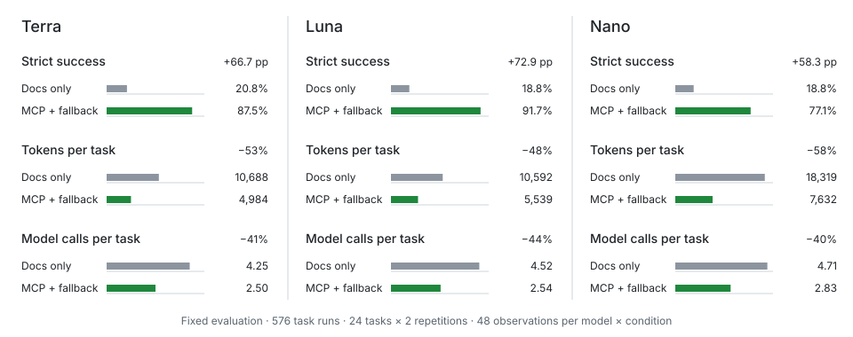

# Local MCP for LLM Chart Authoring

The `ggaction` package includes a local, read-only MCP server that helps a
language model choose current actions and syntax-valid call templates without
preloading the complete documentation. It runs over standard input/output on the user's
machine. It does not require a hosted server, account, or authentication.

The server does not execute chart code, render output, read request-selected
files, make network requests, or collect telemetry.

## Measured impact

A fixed 576-run evaluation compared public-documentation browsing with
MCP-first authoring plus bounded fallback across Terra, Luna, and Nano. Each
model-condition cell contains 48 observations from the same 24 tasks and two
repetitions.



Across all three models, MCP with bounded fallback raised strict task success
from 19.4% to 85.4%, reduced tokens per task from 13,200 to 6,052, and reduced
model calls per task from 4.49 to 2.63. Provider failures remain failures in
these totals rather than being removed after the run.

These results describe one fixed task set and its model and provider conditions;
they are evidence for the authoring route, not a performance guarantee for every
request. See the
[compact benchmark record](https://github.com/ggaction/ggaction/tree/main/benchmarks/llm-authoring-v1)
for the reviewable aggregate data and the
[complete evaluation record](https://github.com/ggaction/ggaction/blob/main/agent_docs/impl/roadmap5.4/phase6/ATTEMPT11.md)
for the condition definitions, paired comparisons, cost boundaries, provider
failure analysis, and limitations.

## Install and launch

Install `ggaction` in the project where the MCP client will run:

```bash
npm install ggaction
```

Launch the installed executable from that project:

```bash
npx --no-install ggaction-mcp
```

For an MCP client configuration, prefer the absolute path to the project-local
executable so the selected `ggaction` version is reproducible:

```json
{
  "mcpServers": {
    "ggaction": {
      "command": "/absolute/path/to/project/node_modules/.bin/ggaction-mcp"
    }
  }
}
```

The exact configuration container varies by MCP client, but the command always
starts the same local stdio process. Node.js 20 or later is required.

## One-tool workflow

The server exposes exactly one model-visible tool:

```text
search_ggaction({ query })
```

Send only the exact user request in one query, including chart or mark type,
transforms, encodings, guides, layout, and output format when they matter. Do
not append dataset contents, code scaffolding, or evaluator instructions:

```text
scatter plot with a color legend at bottom as svg
```

The versioned result is a bounded JSON task packet with:

- `schemaVersion` and `packageVersion` — the packet shape and installed
  package contract that produced it
- `matchedConstraints` — recognized parts of the request
- `actionPlan` — actions and runtime operations in execution order
- `exactCalls` — syntax-valid calls with current option names; template field
  names are not claims about the caller's dataset
- `appliedOptions` — query text that was parsed into a concrete action or
  renderer option
- `placeholderBindings` — required rows, fields, host objects, child programs,
  text, or existing resources that the caller must supply or confirm
- `unmatchedRequirements` — request details retained because they could not be
  applied safely
- `authoring` — exact package imports, `chart()` initialization, reusable
  non-duplicated Canvas/data prerequisites, immutable reassignment steps with
  closed target and derived-data handoffs, and the selected renderer call
- `unsupported` — terminal requirements outside the current contract
- `unresolved` — conflicting or underspecified decisions, each with the exact
  bounded documentation resource needed to continue
- `candidates` — at most three exact resource identities

The MCP response and the deterministic direct adapter use the same serialized
task packet. A packet is never silently truncated; it fails if it exceeds its
6,144-byte hard ceiling.

`authoring.prerequisites` gives the exact signatures and calls for the common
Canvas and data setup that is not already present in `actionPlan`. Supply every
name listed in a prerequisite's `bindings` array—currently the caller-owned
`values` array. If the request explicitly asks to create Canvas or data, the
corresponding call appears once in `authoring.steps` and is omitted from
`authoring.prerequisites`. Keep every returned
`program = ...` assignment because each action returns a new immutable
`ChartProgram`. Run `authoring.steps` in order after those prerequisites:

```javascript
import { chart } from "ggaction";
import { renderToSVG } from "ggaction/svg";

let program = chart()
program = program.createCanvas({
  width: 800,
  height: 600,
  margin: { top: 140, right: 220, bottom: 120, left: 260 }
})
program = program.createData({ values })
program = program.createScatterPlot({
  x: { field: "x", fieldType: "quantitative" },
  y: { field: "y", fieldType: "quantitative" }
})
const output = renderToSVG(program)
```

In this example, `values` is a required caller binding and `x` and `y` are
reported field placeholders. Replace or confirm every
`placeholderBindings` entry before treating the template as a completed user
program. If `unmatchedRequirements` or `unresolved` is non-empty, do not claim
that the request is fully implemented.

The bounded parser does not interpret negation or exclusion clauses such as
`no legend`, `without axes`, or `do not add regression`. These requests return
`request.negation` in `unresolved`, retain the request in
`unmatchedRequirements`, and provide no authoring steps. Interpret the
restriction explicitly before selecting action options; chart defaults can
otherwise reintroduce an excluded feature. Quoted field names such as
`color by "without"` remain literal field names.

The resolver closes only deterministic runtime dependencies. It can add a
required mark owner for density or a named Horizon/polar chart family, pass a
derived dataset to its consumer, bind a unique compatible scale, or name a
stable mark target. It does not invent a missing chart, label positions,
legend channel, or composition children; those
remain explicit `unresolved` decisions.

Generic `area chart` requests leave `chart.area.baseline` unresolved because
the x/y scaffold does not choose a baseline. Generic `strip plot` requests use
a point-mark scaffold and leave `chart.strip.placement` unresolved until the
measure and category or constant placement are specified. Raw `area mark` and
`tick mark` requests remain lower-level mark operations.

Specific phrases such as `radial bar chart` and `polar area chart` take
precedence over their overlapping `bar chart` and `area chart` words. A
separately requested chart, as in `radial bar chart and bar chart`, remains a
separate requirement.

Unsupported output and a missing supported renderer are separate decisions.
For example, `render JPEG` reports terminal `unsupported.jpg` and open
`renderer.format`, but recommends only the bounded renderer-choice section.
The unsupported entry itself requires no documentation read. If the same
request already names SVG, PNG, PDF, or Browser Canvas, it reports only the
terminal `unsupported.jpg` decision.

## Read-only resources

MCP resource discovery provides a small overview, bounded task recipes, and
templates for one exact action card. These resources are for selective reads,
not a replacement full-documentation preload.

Documentation fallback is stricter. A docs section is readable only when its
exact URI appears in an `unresolved[].resources` list from the latest
`search_ggaction` result. `unsupported` entries do not unlock documentation. A
later result without that URI removes access again. This keeps the default flow
compact:

```text
complete request
  → search_ggaction
  → use the task packet when resolved
  → read only the recommended bounded section when unresolved
  → clarify and search again
```

The public machine-readable copies are the typed
[`actions.json`](./actions.json) collection and its
[`item`](./schemas/action-card.schema.json) and
[`collection`](./schemas/action-cards.schema.json) schemas, the
[`intent-taxonomy.json`](./intent-taxonomy.json) resolver vocabulary with its
[`schema`](./schemas/intent-taxonomy.schema.json), the
[`mcp-resources.json`](./mcp-resources.json) bounded resource catalog with its
[`schema`](./schemas/mcp-resources.schema.json), and the
[`task-packet.schema.json`](./schemas/task-packet.schema.json) result contract.
The complete LLM bundle also publishes a
[`manifest`](./llms-manifest.json) and
[`manifest schema`](./schemas/llms-manifest.schema.json). Use artifacts from
the same `packageVersion`; the local installed files remain authoritative for
an installed MCP process.

## What the server does not provide

- Hosted or HTTP transport
- Authentication, accounts, or telemetry
- Chart execution or renderer tools
- Arbitrary filesystem, network, shell, or code access
- A generic tool that returns the complete documentation bundle

Use the [complete action reference](./reference/actions.md) manually when a
human needs the full contract. For normal model-assisted authoring, start with
the one search call and add documentation only for explicit gaps.

## Related

[Getting Started](./getting-started.md) ·
[Chart Recipes](./recipes/index.md) ·
[Rendering](./api/rendering.md) ·
[Supported Features](./supported-features.md)
