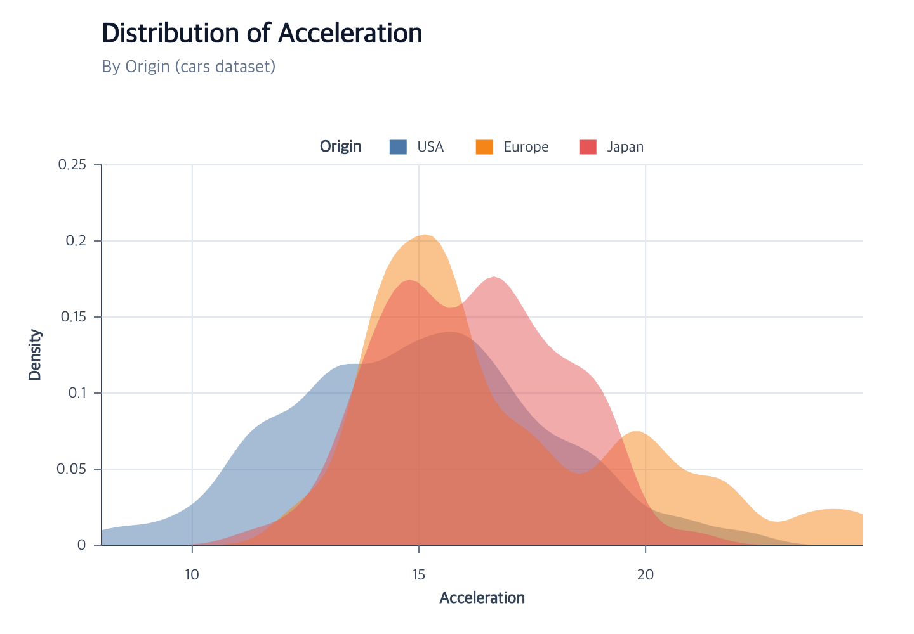

# Density Area Chart Tutorial

## Complete density facade



Use `createDensityPlot` to complete a density chart in one action:

```javascript
import { chart } from "ggaction";

const program = chart()
  .createCanvas({ width: 1000, height: 700, margin: 150 })
  .createData({ id: "source", values: [
    { value: 1, group: "A" }, { value: 2, group: "A" },
    { value: 3, group: "B" }, { value: 5, group: "B" }
  ] })
  .createDensityPlot({ id: "density", field: "value", bandwidth: 1, extent: [0, 6], steps: 61 });
```

Add `groupBy: "group", color: "group"` for two colored profiles. Grouping alone does not add color.
Use `densityChannel: "x"` for horizontal density. Both orientations keep the existing horizontal grid;
explicit grid options can choose a direction. `editDensity` changes the statistical estimate, while
`editAreaMark` changes its appearance. The source remains immutable, and derived profiles retain only
the group and the two generated value/density fields.

The [runnable example](https://github.com/ggaction/ggaction/tree/main/examples/density-plot) includes all three variants.
The workflow below shows the same lower-level owners on car data.




This chart estimates the distribution of car acceleration separately for each
Origin. The source rows remain immutable; `encodeDensity` creates a named
derived dataset and materializes one translucent, zero-baseline area per
group. The complete module below uses the public npm package. The repository
also contains a
[runnable browser example](https://github.com/ggaction/ggaction/tree/main/examples/cars-density-area)
and its [complete program](https://github.com/ggaction/ggaction/blob/main/examples/cars-density-area/program.js).

Start with the Vite project from [Getting Started](../getting-started.md), then
place the tutorial dataset in Vite's public directory:

```bash
mkdir -p public
curl --fail --location https://raw.githubusercontent.com/ggaction/ggaction/main/data/cars.json --output public/cars.json
```

## Complete program

```javascript
import { chart, render } from "ggaction";

const response = await fetch("/cars.json");
if (!response.ok) throw new Error(`Failed to load cars: ${response.status}`);
const cars = await response.json();

const program = chart()
  .createCanvas({
    width: 720,
    height: 500,
    margin: { top: 130, right: 40, bottom: 70, left: 80 }
  })
  .createData({ id: "cars", values: cars })
  .createAreaMark({ id: "densities", opacity: 0.5 })
  .encodeDensity({
    field: "Acceleration",
    groupBy: "Origin",
    bandwidth: 0.6
  })
  .encodeColor({
    field: "Origin",
    scale: { palette: "tableau10" }
  })
  .createGuides({
    grid: { horizontal: {}, vertical: {} },
    legend: {
      position: "top",
      direction: "vertical",
      columns: 3,
      titlePosition: "left",
      offset: 8
    }
  })
  .createTitle({
    text: "Distribution of Acceleration",
    subtitle: "By Origin (cars dataset)"
  });

render(program, document.querySelector("#chart").getContext("2d"));
```

## What the actions establish

| Stage | Semantic result | Graphical result |
| --- | --- | --- |
| `createAreaMark` | Area layer initially bound to `cars` | Empty path collection with opacity `0.5` |
| `encodeDensity` | KDE transform, derived data, x/y and group encodings | Three sorted, baseline-closed command paths |
| `encodeColor` | Origin ordinal color scale | Tableau fills in first-appearance order |
| `createGuides` | Shared axes, two grids, color legend | Grid behind paths; axes and top swatches above them |
| `createTitle` | Chart title and subtitle | Plot-aligned text above the non-overlapping legend |

The density axis defaults to y and includes zero. The value axis preserves the
shared observed extent. Set `densityChannel: "x"` to reverse the orientation;
the axis titles and baseline orientation follow automatically.

The default estimate uses the Gaussian kernel with unit normalization. Use
`kernel` and `normalization` on `encodeDensity`, or call `editDensity` later to
create and bind an immutable revised estimate while preserving the source.

`direction` controls how legend items fill a multi-row grid, while `columns`
sets its maximum column count. `titlePosition: "left"` places `Origin` beside
the three items without changing the chart-wide right-side legend default.

## Move and wrap the title

The title is an independently editable resource. This optional continuation
uses the `program` created above and returns a new program without changing it:

```javascript
const bottomTitleProgram = program
  .editCanvas({
    height: 620,
    margin: { top: 130, right: 40, bottom: 190, left: 80 }
  })
  .editTitle({
    text: "Distribution of Acceleration Across Vehicle Origins",
    subtitle: "Kernel density estimates for acceleration, grouped by origin in the cars dataset",
    position: "bottom",
    align: "center",
    offset: 60,
    gap: 12,
    maxWidth: 270,
    wrap: "word",
    lineHeight: 26
  });

render(bottomTitleProgram, document.querySelector("#chart").getContext("2d"));
```

The title action resolves deterministic lines before rendering. See
[Titles](../api/titles.md) for all four positions, character wrapping, style
editing, and subtitle removal.

## Key action trace

The atomic encoding exposes every reusable action it delegates to.

```text
program
├─ createAreaMark
├─ encodeDensity
│  ├─ createDensityData
│  ├─ editSemantic
│  ├─ encodeX
│  ├─ encodeY
│  ├─ encodeGroup
│  └─ rematerializeAreaMark
├─ encodeColor
│  └─ rematerializeAreaMark
├─ createGuides
│  ├─ createAxes
│  ├─ createGrid
│  └─ createLegend
└─ createTitle
```

## Run and continue

- Serve the repository root and open `examples/cars-density-area/`.
- View the [complete chart program](https://github.com/ggaction/ggaction/blob/main/examples/cars-density-area/program.js).
- Continue with [Encodings](../api/encodings.md),
  [Legends](../api/legends.md), and [Scale options](../api/scales.md).
