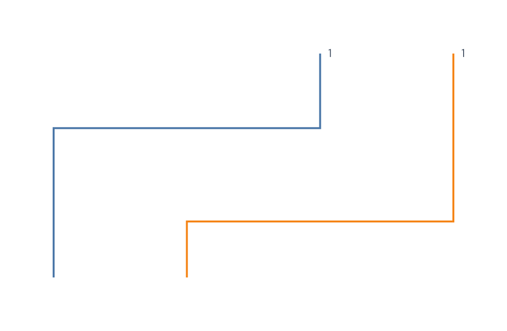

# Empirical Cumulative Distribution Plots



An empirical cumulative distribution function answers: “What share of the
observations is less than or equal to this value?” `createECDFPlot` owns that
statistical definition and expresses the result with ordinary derived data,
Line, encoding, label, scale, and guide actions.

## Build a grouped weighted ECDF

```javascript
import { chart, render } from "ggaction";

const values = [
  { group: "A", value: 1, weight: 2 },
  { group: "B", value: 2, weight: 1 },
  { group: "A", value: 3, weight: 1 },
  { group: "B", value: 4, weight: 3 }
];

const program = chart()
  .createCanvas({ width: 520, height: 340, margin: 55 })
  .createData({ id: "data", values })
  .createECDFPlot({
    id: "ecdf",
    field: "value",
    groupBy: "group",
    weight: "weight",
    color: "group",
    labels: { dx: 10 }
  });

render(program, document.querySelector("#chart").getContext("2d"));
```

The runnable repository version is in
[`examples/ecdf-plot`](https://github.com/ggaction/ggaction/tree/main/examples/ecdf-plot).

## How the step data is defined

For unweighted values `[1, 1, 2, 4]`, the materialized rows represent:

| Support | Cumulative count | Probability |
| ---: | ---: | ---: |
| 1 | 0 | 0 |
| 1 | 2 | 0.5 |
| 2 | 3 | 0.75 |
| 4 | 4 | 1 |

The first row seeds the lower end of the first jump. The Line uses
`curve: "step-after"`, so the visible jump at each support is the
right-continuous definition `F(x) = P(X <= x)`. Equal observations share one
jump instead of depending on source row order.

Grouping computes a separate denominator and path for each group. With
`weight`, the denominator is the sum of positive finite weights. Zero-weight
rows add neither mass nor support. Negative weights and a zero denominator are
errors.

## Reuse the derived rows

Use `createECDFData` when another chart or annotation should consume the same
statistics:

```javascript
const dataOnly = chart()
  .createData({ id: "data", values })
  .createECDFData({
    id: "distribution",
    field: "value",
    groupBy: "group",
    weight: "weight",
    as: { value: "support", cumulative: "mass", probability: "share" }
  });
```

The immutable transform records the source field, grouping, weight and missing
policies, output fields, and resolved denominator for every group.

## Missing values and grouping

`missing` defaults to `"drop"`. It omits a row whose value, weight, or group
field is invalid. Use `missing: "error"` when incomplete input should stop the
action. A negative weight remains an error under both policies.

Color does not create statistical groups. If `color` uses a field, include
that field in `groupBy`; this keeps appearance from silently changing the
denominator.

## Revise the statistical source

Filter raw observations first, then point the ECDF owner at that derived source:

```javascript
const revised = program
  .filterData({
    id: "positive",
    source: "data",
    field: "value",
    predicate: { op: "gt", value: 1 }
  })
  .editECDFPlot({ target: "ecdf", data: "positive" });
```

The edit recalculates denominators and steps, then rebuilds the path, endpoint
labels, and guides while retaining the stored appearance policy. Use
`groupBy: false` to remove grouping or `weight: false` to return to sample
counts. Ungrouping removes a coupled group color; `color: false` removes it
explicitly during another role edit. Line appearance, labels, scales, and guides remain editable through
their ordinary lower-level actions.
