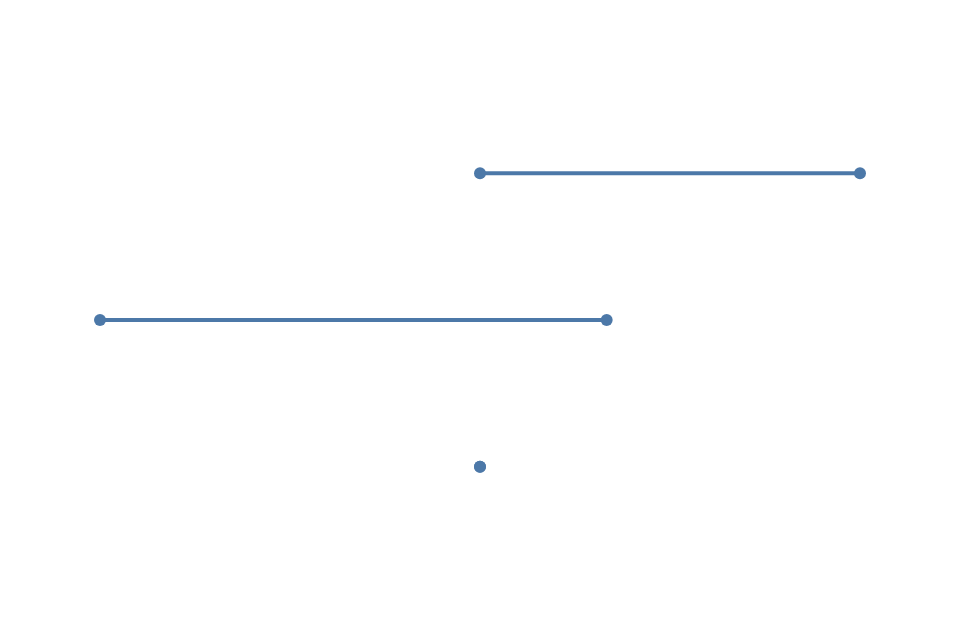

# Dot, Lollipop, and Dumbbell Plots



These three Full entry actions share one categorical endpoint model. Each starts
from immutable rows and produces ordinary point and rule children, so existing
mark, scale, label, guide, and renderer actions continue to work.

```javascript
import { chart, render } from "ggaction";

const values = [
  { category: "A", value: 4, before: 2, after: 5 },
  { category: "B", value: -1, before: 3, after: -1 },
  { category: "C", value: 2, before: 2, after: 2 }
];
const base = chart()
  .createCanvas({ width: 480, height: 320, margin: 50 })
  .createData({ id: "data", values });

const dots = base.createDotPlot({
  category: "category",
  value: "value"
});
const lollipops = base.createLollipopPlot({
  category: "category",
  value: "value",
  baseline: 0
});
const changes = base.createDumbbellPlot({
  category: "category",
  start: "before",
  end: "after",
  labels: { endpoint: "both" }
});

render(changes, document.querySelector("#chart").getContext("2d"));
```

Raw rows remain raw. When categories repeat, set `summary` to `mean`, `median`,
`sum`, `min`, or `max` to request one derived row per category. Ggaction never
chooses an aggregate from the data shape.

Lollipop stems use the same quantitative scale as their value points. The
baseline defaults to zero and may be any finite number. For a log scale, provide
a positive baseline and positive values.

Dumbbell `start` and `end` name semantic roles rather than the lower and higher
number. A reversed or equal pair keeps the same endpoint appearance and label.
Both endpoint fields share one quantitative scale; conflicting scale definitions
are rejected before the caller program changes.

Use `editEndpointPlot` when a source or semantic role changes:

```javascript
const revised = changes.editEndpointPlot({
  data: "replacement",
  start: "after",
  end: "before",
  orientation: "vertical",
  summary: false
});
```

The editor replaces every owned point, rule, label, and summary dataset in one
immutable action while retaining the original appearance and guide policy.
Individual point, rule, label, scale, and guide actions remain the lower-level
style editing path.
