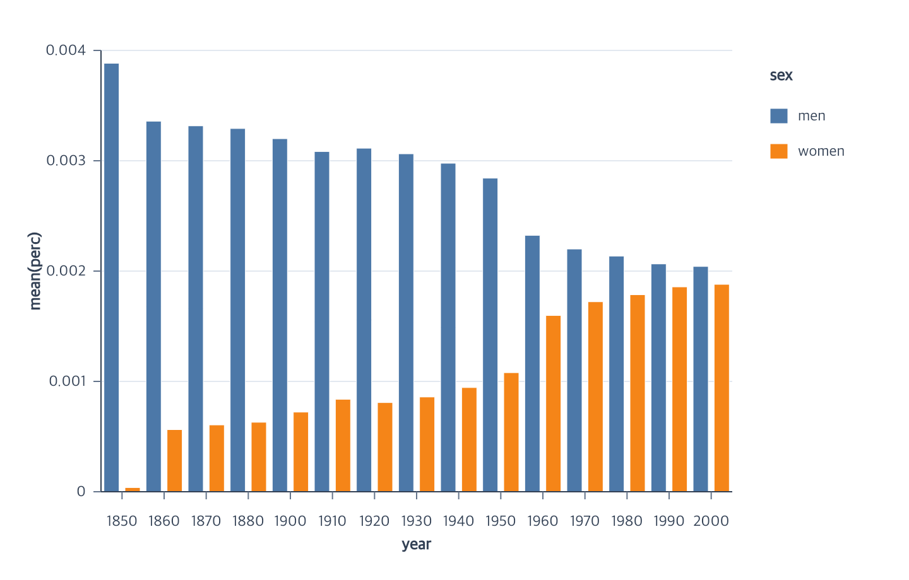

# Bar Chart Tutorial



This tutorial uses a grouped bar chart as one concrete bar-chart layout. It
aggregates job percentages by year and places the mean for men and women side
by side. The complete program uses only the chart-authoring API. The repository contains a
[runnable browser example](https://github.com/hj-n/ggaction/tree/main/examples/jobs-grouped-bar)
and its [complete program](https://github.com/hj-n/ggaction/blob/main/examples/jobs-grouped-bar/program.js).

```javascript
import { chart, render } from "ggaction";

const rows = jobs.filter(
  row =>
    Number.isFinite(row.year) &&
    Number.isFinite(row.perc) &&
    typeof row.sex === "string" &&
    row.sex.length > 0
);

const program = chart()
  .createCanvas({
    width: 720,
    height: 460,
    margin: { top: 40, right: 140, bottom: 70, left: 80 }
  })
  .createData({ id: "jobs", values: rows })
  .createBarMark({ id: "bars" })
  .encodeX({ field: "year", fieldType: "ordinal" })
  .encodeY({
    field: "perc",
    aggregate: "mean",
    scale: { nice: true, zero: false }
  })
  .encodeColor({
    field: "sex",
    layout: "group",
    scale: { palette: "tableau10" }
  })
  .encodeBarWidth({ band: 0.72 })
  .createGuides();

render(program, document.querySelector("#chart").getContext("2d"));
```

## What the actions establish

| Stage | Semantic result | Graphical result |
| --- | --- | --- |
| `createBarMark` | A bar layer bound to `jobs` | An initially empty rect collection |
| ordinal `encodeX` | Year categories and an ordinal x scale | Resolved equal-width year bands |
| aggregate `encodeY` | `mean(perc)` with no stack | A resolved quantitative y scale |
| grouped `encodeColor` | Sex color and xOffset encodings | Resolved color and within-band slots |
| `encodeBarWidth` | No additional semantic state | Concrete centered rectangles using 72% of each slot |
| `createGuides` | Axis, horizontal-grid, and legend definitions | Ordinal/linear axes, grid lines, and a right-side legend |

`layout: "group"` is the atomic grouping choice. It keeps y unstacked and
invokes the advanced xOffset encoding for the same field. `encodeBarWidth`
then has enough stored information to materialize one concrete rectangle for
each observed year/sex cell. Missing cells are omitted.

## Run and continue

- Serve the repository root and open `examples/jobs-grouped-bar/`.
- View the [complete chart program](https://github.com/hj-n/ggaction/blob/main/examples/jobs-grouped-bar/program.js).
- Continue with [Position encodings](../api/position-encodings.md),
  [Series encodings](../api/series-encodings.md), and
  [Constant appearance](../api/appearance.md).
