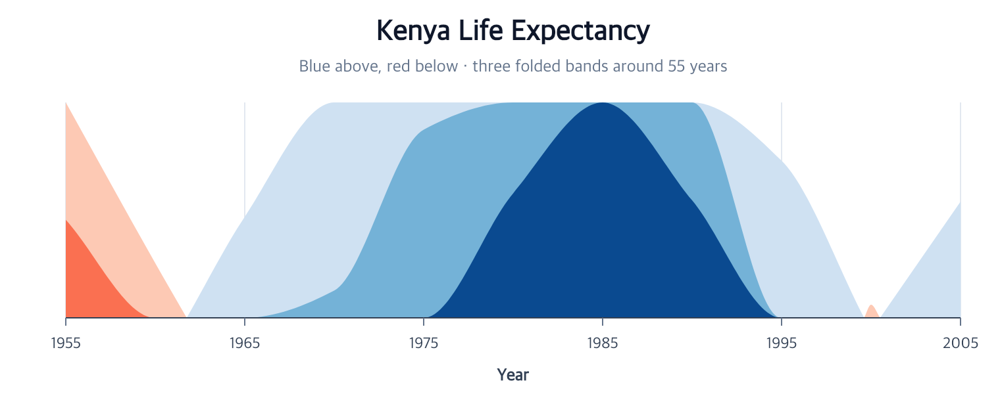

# Horizon Chart Tutorial

## Complete Horizon facade



Use `createHorizonPlot` to author signed bands and the original x axis in one action:

```javascript
import { chart } from "ggaction";

const program = chart()
  .createCanvas({ width: 1000, height: 700, margin: 150 })
  .createData({ id: "source", values: [
    { time: 0, value: -4 }, { time: 1, value: -3 }, { time: 2, value: -1 },
    { time: 3, value: 0 }, { time: 4, value: 1 }, { time: 5, value: 3 }, { time: 6, value: 4 }
  ] })
  .createHorizonPlot({ id: "horizon", x: "time", y: "value" });
```

X and y are explicit source roles. The defaults use three bands on either side of zero, an automatic
shared extent, blue for positive values, and red for negative values. Temporal x values accept the
existing `temporalUnit` option. The folded y scale is `[0, 1]`; the facade shows only the original x
axis and vertical grid. It does not infer an original-amplitude y axis or a legend from internal band keys.

Use `editHorizon` for bands, baseline, palette, or source revisions and `editAreaMark` for opacity,
stroke, and curve. An explicit `area.opacity` is applied after the encoding's opaque default.
All-baseline input correctly produces no area paths while retaining the original x domain.

The [runnable example](https://github.com/ggaction/ggaction/tree/main/examples/horizon-plot) includes
signed, temporal, and baseline/style variants. The program below exposes the same lower owners on real data.



This chart folds Kenya's life expectancy above and below a 55-year baseline
into three compact bands. The source rows stay immutable. `encodeHorizon`
creates one derived dataset and ordinary closed area paths, so Browser Canvas
and the SVG, PNG, and PDF outputs use the same backend-neutral graphics.

The repository contains a
[runnable browser example](https://github.com/ggaction/ggaction/tree/main/examples/gapminder-horizon)
and its [complete program](https://github.com/ggaction/ggaction/blob/main/examples/gapminder-horizon/program.js).

## Complete program

```javascript
import { chart, render } from "ggaction";

const response = await fetch("/gapminder.json");
if (!response.ok) throw new Error(`Failed to load data: ${response.status}`);
const gapminder = await response.json();

const program = chart()
  .createCanvas({
    width: 760,
    height: 300,
    margin: { top: 78, right: 30, bottom: 58, left: 50 }
  })
  .createData({ values: gapminder })
  .filterData({ id: "kenya", field: "country", oneOf: ["Kenya"] })
  .createAreaMark({ curve: "monotone" })
  .encodeHorizon({
    x: "year",
    y: "life_expect",
    bands: 3,
    baseline: 55,
    palette: { positive: "blues", negative: "reds" }
  })
  .createGuides({ axes: { y: false } })
  .createTitle({
    text: "Kenya Life Expectancy",
    subtitle: "Blue above, red below · three folded bands around 55 years"
  });

render(program, document.querySelector("#chart").getContext("2d"));
```

## What the atomic encoding owns

| Decision | Result |
| --- | --- |
| `baseline: 55` | Values are represented as signed deviations from 55 |
| `bands: 3` | Each sign is divided into three equal-amplitude folds |
| `extent: "auto"` | The largest absolute deviation defines the shared band height |
| `missing: "break"` | Missing y values split, rather than bridge, a path |
| `overflow: "clip"` | An explicit smaller extent clips excess amplitude |

The folded y scale is always `[0, 1]`. Because its ticks would describe folded
amplitude rather than the original life-expectancy values, Horizon guide policy
creates only the original x axis and grid and no automatic legend.

## Revise without mutation

```javascript
const revised = program.editHorizon({
  bands: 4,
  baseline: 58,
  palette: { positive: "teals" }
});
```

The revision keeps the source dataset and scale IDs, creates a new namespaced
derived dataset, rebinds the same area layer, and removes the old revision only
when no layer still references it. The earlier `program` remains unchanged.

## Key action trace

```text
program
├─ createAreaMark
├─ encodeHorizon
│  ├─ createHorizonData
│  │  └─ materializeHorizonData
│  ├─ rebindLayerData
│  ├─ encodeX
│  ├─ encodeY
│  ├─ encodeGroup
│  ├─ encodeY2
│  └─ encodeColor
├─ createGuides
└─ createTitle
```

Continue with [Encodings](../api/encodings.md#atomic-horizon),
[Area marks](../api/marks/line-area.md), and [Faceting](../api/composition.md).
