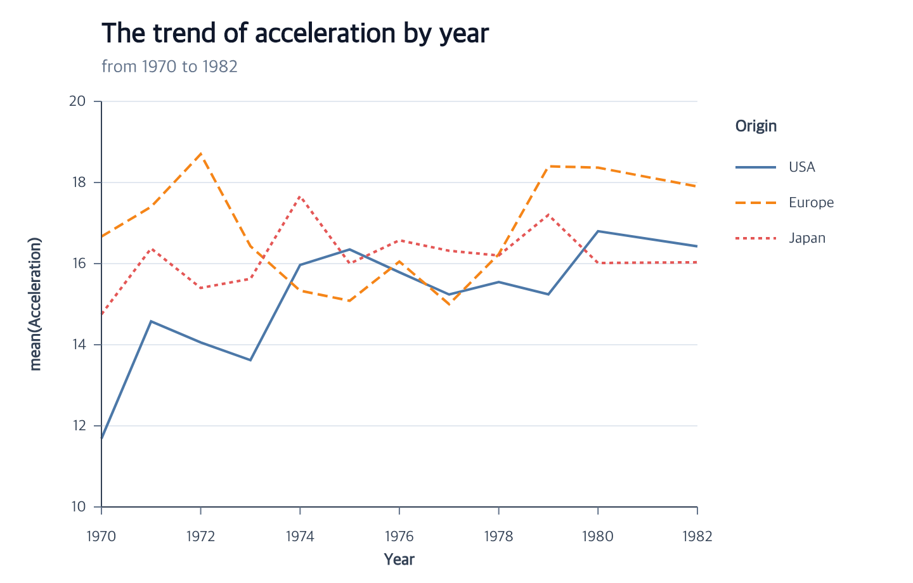

# Cars Line Chart Tutorial



This chart shows mean acceleration over time for each origin. The complete
module below uses the public npm package. The repository also contains a
[runnable browser example](https://github.com/ggaction/ggaction/tree/main/examples/cars-line-chart)
and its [complete program](https://github.com/ggaction/ggaction/blob/main/examples/cars-line-chart/program.js).

Start with the Vite project from [Getting Started](../getting-started.md), then
place the tutorial dataset in Vite's public directory:

```bash
mkdir -p public
curl --fail --location https://raw.githubusercontent.com/ggaction/ggaction/main/data/cars.json --output public/cars.json
```

## Complete program

```javascript
import { chart, render } from "ggaction";

const response = await fetch("/cars.json");
if (!response.ok) throw new Error(`Failed to load cars: ${response.status}`);
const cars = await response.json();

const rows = cars.filter(
  car =>
    typeof car.Year === "string" &&
    Number.isFinite(Date.parse(car.Year)) &&
    Number.isFinite(car.Acceleration) &&
    typeof car.Origin === "string" &&
    car.Origin.length > 0
);

const program = chart()
  .createCanvas({
    width: 720,
    height: 460,
    margin: { top: 80, right: 170, bottom: 60, left: 80 }
  })
  .createData({ id: "cars", values: rows })
  .createLinePlot({
    id: "trends",
    x: {
      field: "Year",
      fieldType: "temporal",
      scale: { nice: true }
    },
    y: {
      field: "Acceleration",
      aggregate: "mean",
      scale: { nice: true, zero: false }
    },
    color: { field: "Origin", scale: { palette: "tableau10" } },
    strokeDash: { field: "Origin" },
    guides: { axes: { y: { ticksAndLabels: { count: 6 } } } }
  })
  .createTitle({
    text: "The trend of acceleration by year",
    subtitle: "from 1970 to 1982"
  });

render(program, document.querySelector("#chart").getContext("2d"));
```

## What the actions establish

| Stage | Semantic result | Graphical result |
| --- | --- | --- |
| `createLinePlot` | Line layer, temporal/aggregate positions, series appearance, scales, and guides | Sorted concrete series paths plus axes, grid, and combined legend |
| `createTitle` | Chart title and subtitle text | Plot-aligned text graphics |

The source rows remain immutable. Aggregation creates derived series values;
it does not replace the dataset. Because color and stroke dash encode the same
field and ordered domain, `createGuides` combines them into one legend.

## Change the curve

Curve is line appearance rather than a semantic field encoding. It can be set
inside the facade:

```javascript
.createLinePlot({
  id: "trends",
  x: { field: "Year", fieldType: "temporal" },
  y: { field: "Acceleration", aggregate: "mean" },
  line: { curve: "step" }
})
```

or edited after the complete chart exists:

```javascript
const smooth = program.editLineMark({
  curve: "monotone",
  strokeWidth: 4
});
```

Both forms regenerate backend-neutral path commands. The stored x/y fields,
mean aggregation, grouping, scales, axes, and legend remain unchanged.

## Change the dash assignment

Use named styles in a field scale when each series needs its own pattern:

```javascript
const named = program.encodeStrokeDash({
  field: "Origin",
  scale: { range: ["solid", "dashed", "dotted"] }
});
```

Or replace the field mapping with one constant pattern:

```javascript
const dotted = named.encodeStrokeDash({ value: "dotted" });
```

The second call removes stroke dash from the categorical legend while keeping
any remaining color component. It also preserves the old named scale as an
immutable semantic resource.

## Key action trace

Aggregate and series actions explicitly rematerialize the path; the renderer
does not infer those relationships later.

```text
program
├─ createLinePlot
│  ├─ createLineMark
│  ├─ encodeX
│  ├─ encodeY
│  │  └─ rematerializeLineMark
│  ├─ encodeColor
│  │  └─ rematerializeLineMark
│  ├─ encodeStrokeDash
│  │  └─ rematerializeLineMark
│  └─ createGuides
│     ├─ createAxes
│     ├─ createGrid
│     └─ createLegend
└─ createTitle
```

## Run and continue

- Serve the repository root and open `examples/cars-line-chart/`.
- View the [complete chart program](https://github.com/ggaction/ggaction/blob/main/examples/cars-line-chart/program.js).
- Continue with [Encodings](../api/encodings.md),
  [Guides](../api/guides.md), [Titles](../api/titles.md), and the
  [Basic Chart contract](../api/basic-charts.md#createlineplot).
