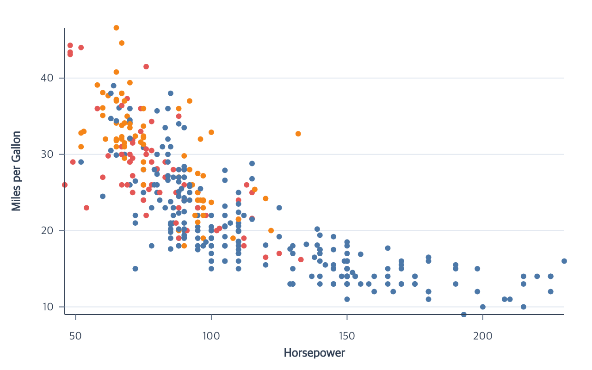

# Cars Scatterplot Tutorial



This tutorial uses the public npm package. The repository also contains a
[runnable browser example](https://github.com/ggaction/ggaction/tree/main/examples/cars-scatterplot)
and its [canonical program](https://github.com/ggaction/ggaction/blob/main/examples/cars-scatterplot/program.js).

Start with the Vite project from [Getting Started](../getting-started.md), then
place the tutorial dataset in Vite's public directory:

```bash
mkdir -p public
curl --fail --location https://raw.githubusercontent.com/ggaction/ggaction/main/data/cars.json --output public/cars.json
```

## Complete program

```javascript
import { chart, render } from "ggaction";

const response = await fetch("/cars.json");
if (!response.ok) throw new Error(`Failed to load cars: ${response.status}`);
const cars = await response.json();
const rows = cars.filter(
  car =>
    Number.isFinite(car.Horsepower) &&
    Number.isFinite(car.Miles_per_Gallon)
);

const program = chart()
  .createCanvas({
    width: 640,
    height: 400,
    margin: { top: 30, right: 30, bottom: 60, left: 70 }
  })
  .createData({ id: "cars", values: rows })
  .createScatterPlot({
    id: "points",
    x: "Horsepower",
    y: "Miles_per_Gallon",
    color: "Origin",
    guides: {
      axes: {
        x: { title: { text: "Horsepower" } },
        y: { title: { text: "Miles per Gallon" } }
      }
    }
  });

const context = document.querySelector("#chart").getContext("2d");
render(program, context);
```

## What each stage establishes

| Stage | Semantic result | Graphical result |
| --- | --- | --- |
| `createCanvas` | — | Canvas dimensions and background |
| `createData` | Immutable named rows | — |
| `createScatterPlot` | Point layer, x/y/color encodings, scales, Cartesian coordinate, and guides | Concrete circles plus grid/axis lines, ticks, labels, and titles |

`createScatterPlot` calls `createPointMark`, the requested encoding actions,
and `createGuides` as wrapped children. Position encodings create the default
`main` Cartesian coordinate before guides are requested. The guide children
read that stored relationship; they do not create or repair coordinates.

## Reassign encodings

The same encoding actions can replace compatible bindings. For a field-sized
variant, omit the earlier constant `encodeRadius` and author the chain without
that conflicting graphical constant:

```javascript
const reassigned = chart()
  .createCanvas({ width: 640, height: 400, margin: 30 })
  .createData({ id: "cars", values: rows })
  .createPointMark({ id: "points" })
  .encodeX({ field: "Horsepower" })
  .encodeY({ field: "Miles_per_Gallon" })
  .encodeColor({ field: "Origin" })
  .createGuides({ axes: { x: {}, y: {} } })
  .encodeX({ field: "Displacement" })
  .encodeY({ field: "Acceleration" })
  .encodeColor({ field: "Cylinders" })
  .encodeSize({ field: "Weight_in_lbs" })
  .encodeShape({ field: "Origin" });
```

The calls reuse the current channel scales, recompute every concrete point and
connected guide, update inferred titles, and preserve explicit guide styling.
`encodeSize` remains incompatible with a stored constant radius; it does not
silently delete that graphical choice.

## Continuous appearance variants

Use a quantitative field type to map point color continuously, then request its
gradient legend:

```javascript
const continuousColor = chart()
  .createCanvas({
    width: 760,
    height: 400,
    margin: { top: 30, right: 150, bottom: 60, left: 70 }
  })
  .createData({ id: "cars", values: rows })
  .createPointMark({ id: "points" })
  .encodeX({ field: "Horsepower" })
  .encodeY({ field: "Miles_per_Gallon" })
  .encodeColor({ field: "Acceleration", fieldType: "quantitative" })
  .encodeRadius({ value: 3 })
  .createGuides({ legend: { channels: ["color"] } });
```

Field opacity uses the same assignment style and automatically maps its domain
to `[0.2, 1]`:

```javascript
const fieldOpacity = chart()
  .createCanvas({
    width: 760,
    height: 400,
    margin: { top: 30, right: 150, bottom: 60, left: 70 }
  })
  .createData({ id: "cars", values: rows })
  .createPointMark({ id: "points" })
  .encodeX({ field: "Horsepower" })
  .encodeY({ field: "Miles_per_Gallon" })
  .encodeRadius({ value: 4 })
  .encodeOpacity({ field: "Acceleration" })
  .createGuides({ legend: { channels: ["opacity"] } });
```

Both guides materialize concrete graphics and update after compatible scale or
Canvas edits.

## Key action trace

The trace keeps the user flow and meaningful guide decomposition. Primitive
property edits remain available deeper in the same tree.

```text
program
└─ createScatterPlot
   ├─ createPointMark
   ├─ encodeX
   ├─ encodeY
   ├─ encodeColor
   └─ createGuides
      ├─ createAxes
      │  ├─ createXAxis
      │  └─ createYAxis
      └─ createGrid
```

## Run and continue

- Serve the repository root and open `examples/cars-scatterplot/`.
- View the [complete browser source](https://github.com/ggaction/ggaction/blob/main/examples/cars-scatterplot/main.js).
- Continue with [Encodings](../api/encodings.md),
  [Guides](../api/guides.md), and the
  [Basic Chart contract](../api/basic-charts.md#createscatterplot).
